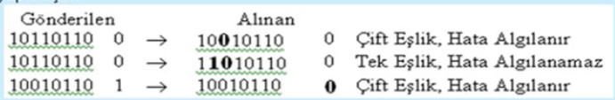
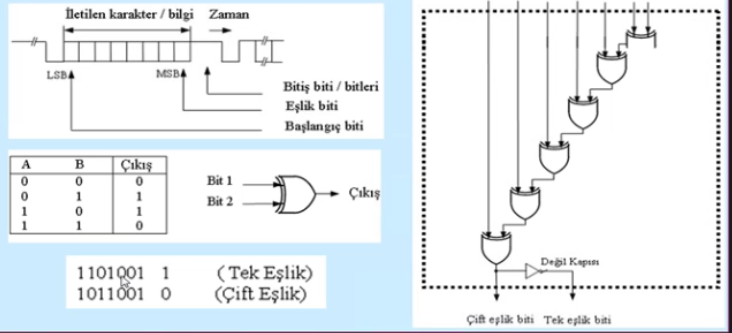
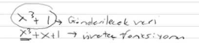
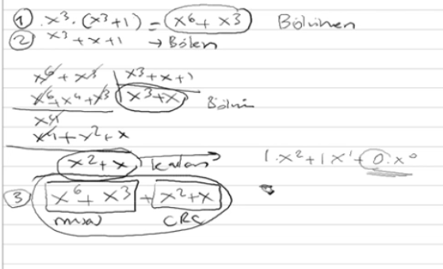
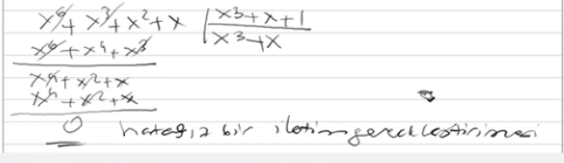
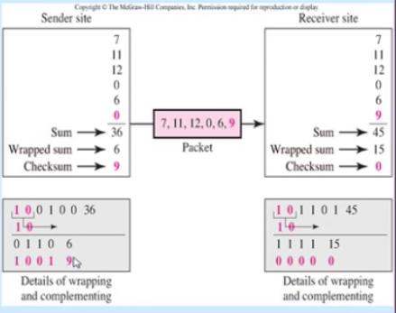

Hata Sezme ve Düzeltme Teknikleri
-----

#### Parity (Eşlik) Biti
Bir veri bloğu içerisindeki tek sayıdaki hatayı sezmek için kullanılır. Bu amaçla veri bloğuna eşlik biti eklenir. 

Odd yada Even olarak adlandırılan iki uygulaması vardır. (Çiftlik - Teklik durumu) Çift eşlikte eşlik bitiyle beraber birlerin sayısı çift tek eşlikte ise birlerin sayısı tek olur.

Bu teknik daha çok boyu 7 yada 8 bit gibi kısa veri bloklarının aktarılmasında kullanılır. Vericinin ve alıcının başlangıçta hangi eşlik bitini kullanacağı belirlenir. Aşağıdaki örnekte verici ve alıcının tek eşlik bitine kurulduğu kabul edilerek inceleme yapılmıştır. 

Parity üretimi

#### Çevrimli Fazlalık Sınaması (CRC)
Gönderilen veri bitleriden hesaplanan bir sınama kodu, gönderilecek veri bitlerinin sonuna eklenir. CRC kodunu hesaplamak için donanım desteği veren iletişim yongaları mevcuttur. Üreteç fonksiyonu CRC yönteminde anahtar kelimedir. Ethernet Token Ring ATM gibi protokoller bu tekniği kullanırlar. 

#### Kontrol Toplamı (Checksum)

Checksum tcp/ip yığınındaki protokollerde başlık yada başlıkla beraber verinin iletiminde bir hatanın olup olmadığını anlamada kullanılır. Gönderilecek veri bitlerinin toplamı alınır ve sonra bulunan toplam veri bitlerine eklenerek öyle gönderilir.

Toplamalar tümleyen aritmetiğine göre yapılır. Alıcı gelen sayıları toplar ve sonra tümleyenini alır, sonuç sıfırsa hata yoktur sıfırdan farklıysa yeniden iletim yapılır.

