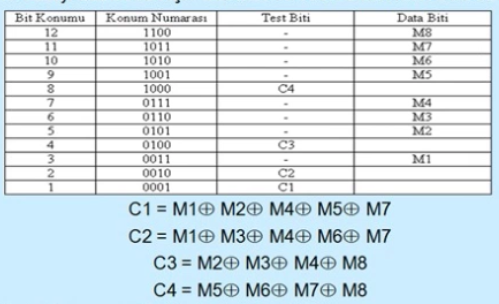

Hata Sezme ve Düzeltme Teknikleri
-----

#### Parity (Eşlik) Biti
Bir veri bloğu içerisindeki tek sayıdaki hatayı sezmek için kullanılır. Bu amaçla veri bloğuna eşlik biti eklenir. 

Odd yada Even olarak adlandırılan iki uygulaması vardır. (Çiftlik - Teklik durumu) Çift eşlikte eşlik bitiyle beraber birlerin sayısı çift tek eşlikte ise birlerin sayısı tek olur.

Bu teknik daha çok boyu 7 yada 8 bit gibi kısa veri bloklarının aktarılmasında kullanılır. Vericinin ve alıcının başlangıçta hangi eşlik bitini kullanacağı belirlenir. Aşağıdaki örnekte verici ve alıcının tek eşlik bitine kurulduğu kabul edilerek inceleme yapılmıştır. 

Parity üretimi

#### Çevrimli Fazlalık Sınaması (CRC)
Gönderilen veri bitleriden hesaplanan bir sınama kodu, gönderilecek veri bitlerinin sonuna eklenir. CRC kodunu hesaplamak için donanım desteği veren iletişim yongaları mevcuttur. Üreteç fonksiyonu CRC yönteminde anahtar kelimedir. Ethernet Token Ring ATM gibi protokoller bu tekniği kullanırlar. 

#### Kontrol Toplamı (Checksum)

Checksum tcp/ip yığınındaki protokollerde başlık yada başlıkla beraber verinin iletiminde bir hatanın olup olmadığını anlamada kullanılır. Gönderilecek veri bitlerinin toplamı alınır ve sonra bulunan toplam veri bitlerine eklenerek öyle gönderilir.

Toplamalar tümleyen aritmetiğine göre yapılır. Alıcı gelen sayıları toplar ve sonra tümleyenini alır, sonuç sıfırsa hata yoktur sıfırdan farklıysa yeniden iletim yapılır.

#### Hata Düzeltme Tekniği
Göndericinin bilgiyi bozulma durumunda tekrar göndermesinin güc olduğu bazı uygulamalarda uygun kodlama ile hatanın alıcıda düzeltilmesine çalışır.

İletim ortamında bozulabilecek bit sayısının üst sınırının bilindiği varsayılır. Bu durum alıcının gönderilen veriyi belirli bir bozulma ölçüsüne kadar düzeltebileceğini ifade eder. Bu tür yöntem iletim yolu çok pahalı ise yada yeniden iletim büyük bir gecikme oluşturuyorsa kullanılır. 

#### Hamming Kodlaması
Alıcıya ulaşan ve belirli simgeye karşılık düşen ikili kod yolda bir ölçüde bozulmuş olsa bile alıcıda asıl gönderilen kod ede edilebilir. 

Hamming tekniği mesafe özelliği ile beraber kullanılır. Mrneğin mesafe değeri 2 ise, alıcıda 1 bitlik hatalar sezilir ve düzeltilir. 2 bitlik hatalar sadece sezilir. Bu literatürde HD2 olarak isimlendirilir.

