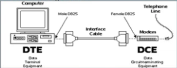
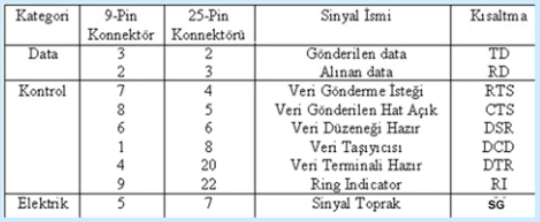

RS-232 ve Asenkron Seri İletim
---------

#### DTE - DCE Standartları
Genel olarak terminal gibi cihazların sahip oldukları standart portlar üzerinden yapılacak ağ bağlantısını tanımlamaktadır. Bu standartlar özellikle WAN ağ cihazlarında yoğun olarak kullanılmaktadır.

DCE iletişim kanalının bağlandığı donanımdır. Modem ucudur. Model seri portları DCE yapılandırılmıştır.

DTE Uç düğümlerdir PC seri portları DTE olarak yaılandırılmıştır.

DTE-DCE arasındaki fiziksel katman protokolü lojik işaretlerin elektriksel işaretlere dönüştürülmesinde yaygın olarak NRZ-L kodlama tekniği kullanılır.

#### RS-232
RS: Recommended Standard demektir.
EIA'nın bilgisayar terminal ve modem arabağlaşımı için önerdiği bir standarttır.
RS-232 iki cihaz arasında bilgi transferine yönelik tasarlanmıştır. Mesafe kablo tipi ve bit hızına göre 20 ile 40 metre arasında değişir. Belirtilen mesafelerde 9600 bps ve 19200 bpslik iletim hızları kullanılır. Dengesiz Hatlar sınıfında arayüz standardıdır. Şu konumlarda kullanılır;

* Modem bağlantısında
* Veri toplama modüllerinde
* Test cihazlarında
* Kontrol devrelerinde
* İki bilgisayar arası basit bir link için

**Loopback (Döngü sınama)** Bu döngü sınama fişi haberleşme programları yazarken çok kullanışlı olabilir. Seri porttan gönderilen bir verinin aynı porttan hemen alınmasını sağlamak için TD ve RD çıkışları birbirine bağlanmıştır. Eğer bu fişi seri porta takıp Terminal programını yükerseniz herhangi birşey yazdığınızda hemen ekranda görüntülenir.

