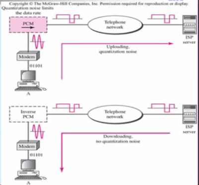
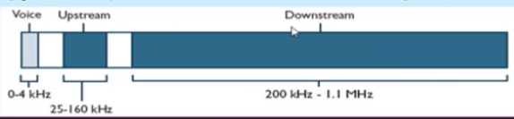
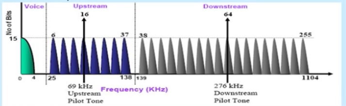
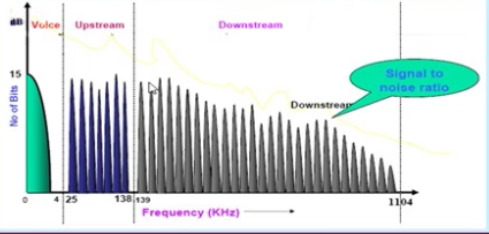

ADSL (Asymmetric Digital Subscriber Line)
--------

POTS (Plain old telephone service) standart telefon hizmetine karşılık gelir. POTS ağı aynı zamanda public switched telephone network (PSTN) olarak isimlendirilir. Sonrasında telefon hatlarından veri iletişim yapmak için çevrimeli ağ (dila-up) modemler geliştirilmiştir. Bu modemlerle erişilebilecek veri hızları 64kbps ile sınırlıdır. Bu hızlar internet bağlantısı için yeterli değildir.

Ev kullanıcılarına daha hızlı internet erişimini sağlayabilmek için DSL teknolojisi geliştirilmiştir. Ayrıca TV programlarının ev kullanıcılarına iletimi için geliştirilen Kablo TV ağlar da hızlı internet erişimi için DSL teknolojilerine alternatif olarak sunulmaktadır.

#### PSTN
Manuel PSTN, Analog Anahtarlamalı PSTN ve Sayısal PSTN şeklinde bir gelişim göstermiştir.

Abone hattından gelen sinyal, CO switch'e girdiğinde A/D dönüşümden önce 4kHz'lik Alçak geçiren filtreden geçer. Bir çok kanal switch vasıtasıyla karışıklı bağlantı kurarak anlaşabilir.

#### Çevirmeli Ağ (Dial-Up) Bağlantısı
Dial-Up modem veri aktarımı için ses hatları üzerinden 600 hz ile 3000 hz arasındaki frekans bandını kullanarak modülasyon ve demodülasyon işlemlerini yapar.

PC'deki sayısal veri modem vasıtasıyla analog sinyal haline dönüştürülür. Bu analog sinyal TELCO anahtar cihazı içerisindeki PCM (darbe kod modülasyonu) vasıtasıyla PSTN ağı için tekrar sayısal hale getirilir. Diğer tarafta tersi işlemler yapılarak iki uç düğüm arasında bir veri aktarımı yapılır.

#### ADSL (Asymmetric Digital Subscriber Line)
Çok uzun yıllar telefon ağlarında 4kHz'den yukarısı kullanılmadı. Bu durum mevcut yerel çevrim kabloların 4kHz üstü frekans spektrumunu daha etkin kullanmak ADSL teknolojilerini ortaya çıkardı. ADSL günümüzde bakır telefon kabloları üzerinden 4kHz'den 1.1mHz arası band genişliğini yüksek hızlı veri servisleri için etkin bir şekilde kullanılır.

Bu frekans bandı POTS için kullanılan band ile örtüşmez böylece hem telefon hemde internet hizmeti alınabilir.

Asymmetric bir yöndeki veri akışının diğer  yöndekinden daha hızlı olmasıdır. upstream'den daha hızlı bir downstream hızını tanımlar. Örneğin 1024/256 kbps

Digital Veri tamamen sayısaldır ve sadece uçta yerel çevrim hattı üzerinden taşınabilmek için modüle edilir.

Subscriber Line veri aboneye tek bir burulmuş çift bakır kablo çevrimi üzerinden taşınır.

#### ADSL'de Mesafe
Genelde DSL için tekrarlayıcı kullanmadan maksimum mesafe 5.5km'dir. Telefon şirketlerinin ofisine olan mesafe azaldığında veri hızı artar. Daha uzun mesafeler için fiber optik kablo ile genişletişmiş bir dsl hattına sahip olmanız gerekir. 

Adaptif bir teknolojidir. Sistem abone hattının durumuna bağlı olarak uygun bir veri hızı kullanır. Şu faktörler hızı etkiler
* Yerel merkezden uzaklık
* Kablo tipi ve kalınlığı
* kablodaki ek sayısı ve çeşidi
* ADSL, ISDN ve ses harici sinyalleri taşıyan diğer kablolarla olan yakınlığı
* Radyo vericiye yakınlığı

####ADSL Modülasyon Teknikleri
Modülasyon biginin bir elektronik veya optik taşıyıcı dalgaformu üzerine bindirilmesidir. ADSL sinyalinin modülasyonu için 2 standart vardır bunlar CAP (Carrierless Amplitude and Phase) ve DMT (Discrete Multi-Tone).

QAM her iki modülasyon çeşidinin temelidir. DMT modülasyonu CAP modülasyonundan çok daha karmaşıktır. CAP DSL gerçeklemelerinde ilk kullanılan teknolojidir, fakat şuanda yaygın kullanılan method DMT'dir. Bu modülasyon teknikleri sayısal bir sinyalin nasıl gönderileceğini ve hattan nasıl alınacağını belirler.

#### CAP (Carrierless Amplitude and Phase)
Bu modülasyonda downstream ve upstream için tek bir taşıyıcı frekansı kullanılarak modüle edilir ve sonra telefon hattına verilir. Bu taşıyıcı herhangi bir bilgi içermez ve alıcıda yeniden oluşturulabilir.

Taşıyıcı kendisini iletimden önce bsatırır, yani CAP taşıyıcı frekansını filtreleyen bir sinyal üretir. Bundan dolayı bu metoda taşıyıcısız sıfatı kullanılır. Ses upstream ve downstream kanalları kanallar arası girişim olasığını minimuma indirmek için birbirinden ayrılır.

#### DMT (Discrete Multi-Tone)
DMT yaygın kullanılan ve çok taşıyıcılı bir modülasyon methodudur. Bir hat üzerinden yüksek hızda bir veri gönderebilmek amacıyla paralel olarak çalışan N tane göreceli düşük hızlı verici-alıcı (transceiver) kullanma fikri, DMT modülasyon çeşidini ortaya çıkartmıştır. N tane düşük hızlı bilgi akışı, birbirinden farklı N tane alt frekans bandı kullanılarak ayrı tutulmuştur. DMT bu kanalları Ayrı Hızlı Fourier önüşümü olarak bilinen bir sayısal teknik kullanarak oluşturur.

#### ADSL DMT Frekans Spektrumu
DMT kullanılabilir frekans aralığını her bir 4.3125 kHz'lik 256 kanala ayırması için DSL sinyalini bölümler. ilk 6 taşıyıcı ses ve koruma bandı olarak kullanılır. DMT 32 adet upstream frekans kanalı ve 218 adet downstream frekans kanalına sahiptir.

#### DMT Modülasyonunda SNR-Hız ilişkisi
DMT tekniğinde gelen veri toplanır ve sonra bir çok küçük farklı taşıyıcılar üzerinden dağıtılır. Bu taşıyıcıların her biri QAM modülasyonunun bir çeşidini kullanır (QPSK, QAM, 64 QAM vb)

Modülasyon methodu sinyal kalitesine bğalıdır. Yüksek frekans aralığındaki kanalllar genellikle düşük kaliteye sahiptir. 1mHz'den daha yüksek frekanslar bozulmalardan daha fazla etkilenir. Her bir kanal uygun bir modülasyon methodunu kullanır.

Her bir alt taşıyıcı, sinyal gürültü oranına bağlı olarak kaç bit kullanılacağın karar verir Bu değer maksimum 15bit/hz olabilir.

