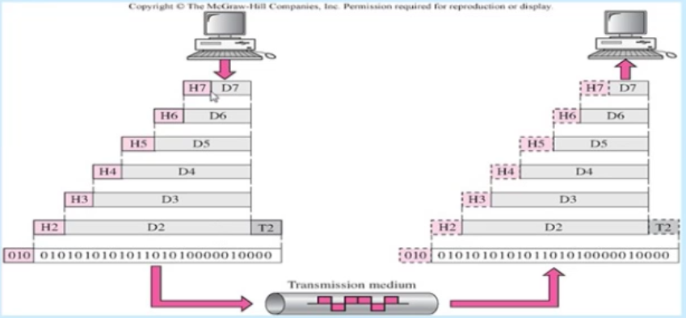
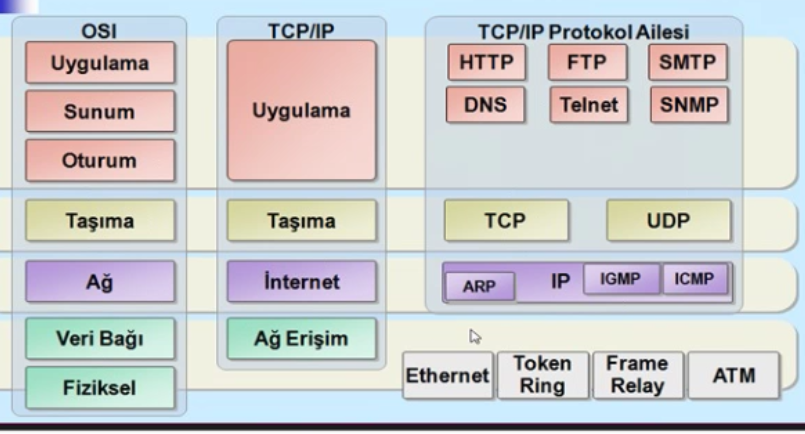

Veri İletişimine Giriş
-------

#### Protokol
İletişim için oluşturulan kuralların bütününü tanımlar, Hem gönderici hemde alıcı tarafında aynı yapıya ihtiyaç duyulmaktadır. 

Protokolün belirli bir formatı ve veri yapısı vardır. Frame adı altında (Çerçeve) çeşitli datalar saklanır. Örneğin Hedef adresi, Kaynak adresi veya verinin kendisi

Protokolde gelen datayı anlamlı kılan semantik bir kısım vardır. Gelen datanın doğru gelip gelmediği ile ilgilenir.

Son olarakta zamanlama protokolün ne kadar hızlı çalıştığı ve doğru sıralamada gelip gelmediği incelenir bu işe senkronizasyonda denebilir.

_Örneğin A, B'e veri gönderiyor, B saniyede 10 sayı okuyabiliyor ancak A saniyede 100 sayı gönderiyor. Gönderilen 90 sayı ne olacaktır?_

#### Standartlar
Farklı bir çok ürün vardır. Bu ürünlerin belirli standartlar altında birlikte çalışılabilmesi için geliştirilmiştir. Üreticiler ürünlerini bu standartlara göre yapar. 

Bazı Standart Organizasyonları
* ISO
* ANSI
* EIA
* IEEE
* ITU-T
* ATM Forum
* IAB
* RFC

2 standart kategori vardır
* **De facto standart** - benimsenen kabul edilen (Ethernet)
* **De jure standart** - kural - IEEE 802.3

Ticari uygulamalarının verdiği isimler daha yaygınsa **de facto** standart, Standart organizasyonlarının verdiği isimler daha yaygınsa **de jure** standarttır.

#### Hat Konfigurasyonu

**Hat:** Fiziksel iletişim yolu

**Hat Konfigürasyonu**: Bir cihazın bir hattaki ilişkisini tanımlar.

İki farklı hat konfürasyonu vardır
* Noktadan noktaya (point to point), İki cihaz arasında direk bağlantının olduğu durumdur. Sadece 2 bağlantı hattı paylaşır.

* Çoklu nokta bğalantısı (multipoint), İkiden daha fazla cihaz hattı paylaşır, kanal kapasitesi cihazlar arasında paylaşılır.

#### Topolojiler

Bilgisayar ağını oluşturan elemanların yada birimlerin fiziksel veya mantıksal bağlantı ile oluşturulduğu yapı.

4 tip topoloji vardır.

* Yol (Doğrusal) topoloji
* Yıldız (Star) topoloji
* Halka (Ring) topoloji
* Mesh topoloji

#### İletim Modları

İletim modları bir sistemde iletimin nasıl gerçekleştiğini tanımlar

* Simplex (Tek yön) _Televizyon_

* Half duplex (Her iki yönde ancak aynı anda aktarım olma) _Polis radyosu_

* Full duplex (Aynı anda her iki yönde) _Telefon_

#### Coğrafi yapılara göre ağ kategorileri

* BAN (Body Area Network)  **~1m**
* PAN (Personal A.N.) **~10m**
* LAN (Local A.N.) **~500m**
* MAN (Metropolitan A.N.) **~3-25km**
* WAN (Wide A.N.) **~>10km**

_Sayılar temsilidir. İlk tasarlanırken bu şekilde düşünülmüştür. Zaman içinde değişmiş güncellenmiştir._

Örneğin bluetooth pan kategorisinde bulunmaktadır. 

#### Ağ Modeli
OSI referans modeli haberleşme sistemi problemini çözmek üzere ISO tarafından 1984'te Açık Sistem Bağlantıları (Open Systems Interconnection) adıyla oluşturulmuştur.

7 Katmandan oluşmaktadır 
* (7) Application: Uygulamalara ağ servisleri sunar
* (6) Presentation: Veri formatı
* (5) Session: Uç birimler arası iletişim
* (4) Transport: Uçtan uca bağlantı
* (3) Network: Adres ve en uygun patika
* (2) Data link: İletim ortamına erişim
* (1) Physical: İkili sayıların transferi

#### Kapsülleme
Katmanlar arasında header ekleme ve silme işlemidir.

#### OSI ve TCP/IP

TCP/IP mimarisinde uygulama katmanı, OSI'de Uygulama Sunum ve Oturum katmanlarına karşılık gelir. Taşıma aynı şekilde taşımada, İnternet ağda, Ağ erişimde veri bağı ve fiziksel katmanlar olarak düşünülmüştür.

TCP/IP Protokol ailesinde;
* HTTP, FTP, SMTP, DNS, Telnet.. gibi protokoller uygulama
* TCP veya UDP taşıma
* IP (ARP, IGMP, ICMP) internet katmanı
* Eternet, Token Ring, Frame Relay, ATM Ağ erişim katmanını tanımlar.

