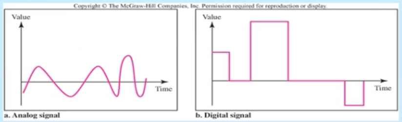

Sinyaller
-----------

#### Veri
Bilgiyi yada anlamı taşıyan birimdir. 
* Analog Veri: Ses, Video
* Sayısal Veri: 010101010 (text, integer)

#### Sinyal
Verinin elektrik yada elektromanyetik gösterilimi.
* Analog Sinyal: Genlik ve sıklığı zamanda sürekli değişken dalga, Sürekli sinyal
* Sayısal Sinyal: Genlik ve sıklığı sabit bir seviyeden diğer bir sabit seviyeye değişen sinyal, Ayrık sinyal

#### İletim
Sinyallerin yayılması ve işlenmesi vasıtasıyla verinin iletişimi
* Analog İletim: Analog veya Sayısal verinin analog sinyal vasıtasıyla taşınmasıdır.
* Sayısal İletim: Analog veya Sayısal verinin sayısal sinyal vasıtasıyla taşınmasıdır.

$$test+1 $$