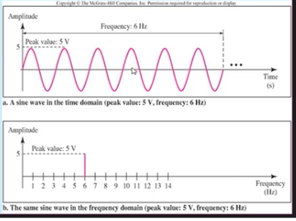
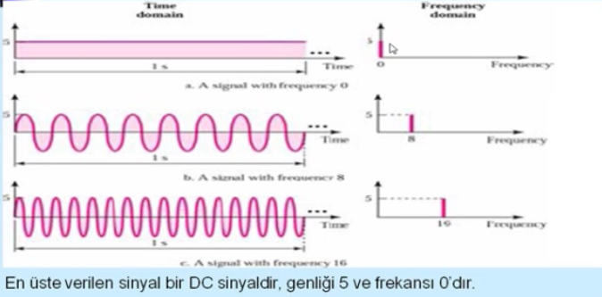
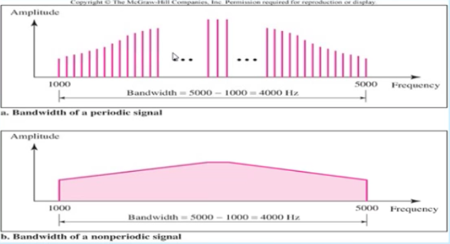
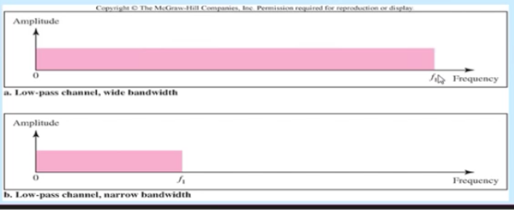
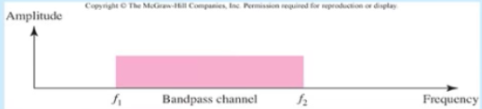
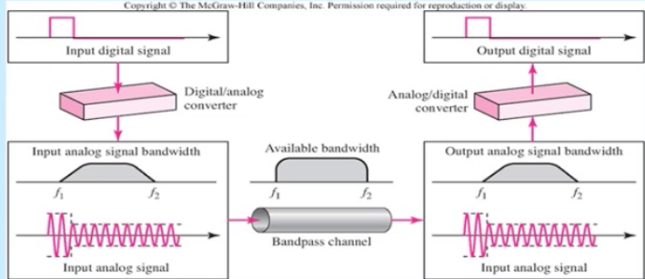

Sinyaller
-----------

#### Veri
Bilgiyi yada anlamı taşıyan birimdir. 
* Analog Veri: Ses, Video
* Sayısal Veri: 010101010 (text, integer)

#### Sinyal
Verinin elektrik yada elektromanyetik gösterilimi.
* Analog Sinyal: Genlik ve sıklığı zamanda sürekli değişken dalga, Sürekli sinyal
* Sayısal Sinyal: Genlik ve sıklığı sabit bir seviyeden diğer bir sabit seviyeye değişen sinyal, Ayrık sinyal


#### İletim
Sinyallerin yayılması ve işlenmesi vasıtasıyla verinin iletişimi
* Analog İletim: Analog veya Sayısal verinin analog sinyal vasıtasıyla taşınmasıdır.
* Sayısal İletim: Analog veya Sayısal verinin sayısal sinyal vasıtasıyla taşınmasıdır.

#### Zaman ve Frekans Düzlemi

Zaman düzlemi sinyalin zamana göre değişimini gösterir. Frekans düzlemide frekans ve genlik arasındaki ilişkiyi gösterir.



#### Frekans Düzlemi Kavramları

**Temel Frekans** Bir sinyalin tüm frekans bileşenleri bir frekansın tamsayı çarpanı ise, bu frekans temel frekans olarak isimlendirilir.

**Spektrum** Sinyali içeren frekans aralığı

**Bandgenişliği** Spektrum genişliği

**Efektif Bandgenişliği** Hemen hemen bandgenişliği ile aynıdır ve sinyal enerjisinin çoğunu içeren darandlı frekans aralığını tanımlar.

**DC Bileşeni** Sıfır frekans bileşeni.



#### Frekans Spektrumu ve bandgenişliği

Bir sinyalin frekans spektrumu, sinyalin tüm frekans bileşenlerinin toplamıdır.

Bir sinyalin bandgenişliği, Herhangi bir iletim sistemi sınırlı bir frekans bandına sahiptir bu durum taşınabilen veri hızının sınırını gösterir, bir iletişim kanalı içerisinde mevcut frekans spektrumun genişliği de denebilir.

Örnek bandgenişlikleri;
* Konuşma bandgenişliği 100Hz - 7kHz
* Telefon bandgenişliği 300Hz - 3.4kHz
* Video bandgenişliği 4mHz




#### Sayısal Sinyal İletimi (Baseband/broadband)

##### Baseband
Sayısal sinyal iletimi baseband veya broadband modülasyon tekniklerinden biri kullanılarak yapılabilir.

Baseband iletiminde sayısal sinyal analog sinyale çevrilmeden gönderilir. Bu işlem, baseband modülasyonu yada hat kodlama olarak tanımlanır.

Baseband iletiminde low-pass (alçak geçiren) bir iletişim kanalı kullanır. İletim ortamı sadece bir kanal oluşturur.




```
Band genişliği = (Max harmonik) * Hız / 2
```

__Örnek soru__: _Baseband iletiminde 1 kbps hızla veri göndermek için gerekli bant genişliği ne olmalıdır?_

__Çözüm__
```
Band genişliği = 1 * 1kbps / 2 = 500Hz
Eğer 1 ve 3 harmonik kullanılacaksa;
Band genişliği = 3 * 1kbps / 2 = 1.5kHz
```

##### Broadband

Broadband iletiminde sayısal sinyal modüle edilerek analog sinyale çevrilir. Bu modülasyon (dönüşüm) bant geçiren (passband) bit kanal oluşturmayı sağlar.

Günümüzde kullandığımız telefon sistemleri (GSM..) Tv yayınları ve geniş alan ağ teknolojileri (Frame Relay, ATM) broadband iletime örnektir.

Broadband iletimde sayısal sinyali analog sinyale dönüştürmek için modem ( modulator/demodulator ) kullanılır.




