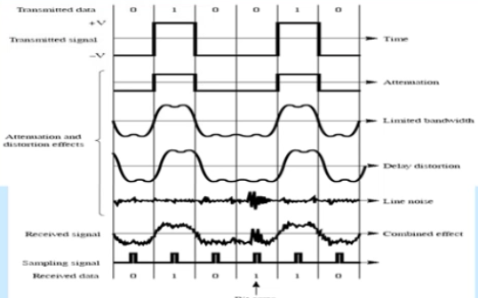
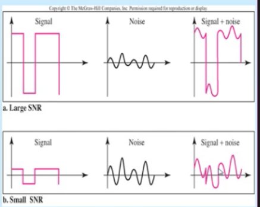
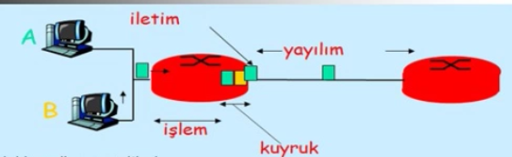
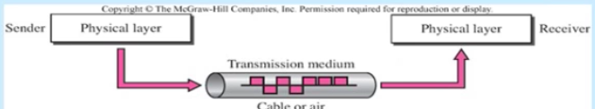
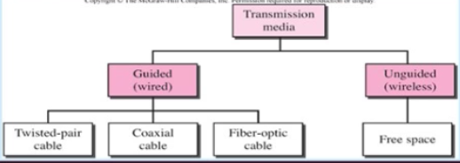
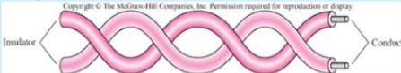
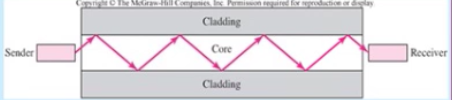

İletim Bozulmaları, Kanal kapasitesi, ağlarda gecikme ve İletim ortamları
-------
#### İletim Bozulmaları
Alınan sinyal gönderilen sinyallerden farklı olabilir. Analog iletimde sinyal kalitesinde bozulma verim kaybı, sayısal iletimdede bit hataları olabilmektedir.

İletim ortamındaki bozulmaların ana kaynağı;
* İletim ortamının çeşidi
* İletilen verinin bit hızı
* Haberleşen iki cihaz arası mesafe

İletim Bozulma çeşitleri
* Zayıflama (Attenuation)
* Sınırlı Bandgenişliği (Limited Bandwidth)
* Gecikme Bozulması (Distortion)
* Gürültü (Noise)


* Zayıflama (Attenuation)


Zayıflama sinyal gücünün mesafeye bağlı olarak azalmasından kaynaklanır. Güclendirici veya tekrarlayıcı kullanarak sorun çözülebilir. 

```
dB = 10log(sinyalin son durumdaki gücü (watt) / sinyalin üretilirken gücü (watt))
```

* Sınırlı Bandgenişliği (Limited Bandwidth)


Bir sinyal farklı frekans bileşenlerinin toplamından oluşuyordu, herhangi bir iletişim kanalı sınırlıdır. Bu yüzden bandgenişliğinin dışında kalan frekanslar kayıp edilecektir.

* Gecikme Bozulması (Distortion)

Sinyalin şekli değişir, bir sinyalin iletim ortamındaki kayma durumuna denir.

* Gürültü (Noise)

Verici ve alıcı arasındaki sinyale ek (istenmeyen) sinyaller eklenir. Bazı gürültüler;
* Termal gürültü
* Intermodulation gürültü
* Crosstalk (yanses, başka kabloların etkisi yüzünden oluşan gürültüdür)
* Impulse Gürültüsü

#### Sinyal gürültü oranı
Bir sinyalin içerdiği gücün gürültü gücüne oranı iletimde önemli bir konudur ve sinyal gürültü oranı SNR olarak tanımlanır.

```
SNR(db) = 10 log (Sinyal gücü / Gürültü gücü)
daha önce zayıflama miktarını anlamak için bu formülü kullandık.
```



#### Kanal kapasitesi
Daha büyük bir band genişliği daha yüksek bir bilgi taşıma kapasitesi sağlar. Bu mantığa göre herhangi bir sayısal dalga aslında sonsuz bir bandgenişliğine sahiptir. Fakat iletim ortamı bozulmalardan dolayı, bu bandgenişliği sınırlandıracaktır ve bununla birlikte herhangi verilen bir ortam için daha yüksek bandgenişliği iletim maaliyetinin artmasına neden olur, buna karşılık band genişliğini sınırlamak bozulmalara neden olmaktadır.

Bütün bunlara bağlı olarak Kanal kapasitesi, belirli şartlar altında verilen bir iletim ortamı yada kanalı üzerindne iletilebilecek maksimum bit hızını tanımlar, **Nyquist** tarafından gürültüsüz ve **Shannon** tarafından gürültülü kanal için bit hızları belirlenmiştir. Bandgenişliği, gürültü ve hata oranı gibi 3 faktörden etkilenmektedir.

#### Nyquist Bit Hızı
Gürültüsüz ve hatadan yoksun bir kanal için tanımlanır. Bandgenişliği B ise en yüksek haberleşme hızı 2B'dir. İki voltaj seviyeli binary sinyal için;

```
Nyquist bit hızı = 2B(bps)
```
Çoklu voltaj seviyesine veya sinyal seviye sayısına (L) sahip sinyal için Nyquist bit hızı
```
Nyquist bit hızı = 2Blog2L(bps)
```

**Örneğin** _L=8 ve 3000Hz bandgenişliği için Nyquest bit hızı = 18kbps olur._

#### Shannon Kapasite Formülü
Bit hızı gürültü ve hata hızı arasındaki iliki dikkate alınırsa, bir hızı nekadar artarsa her bir bitin süreside okadar azalır, bu yüzden bir gürültü patlaması durumunda daha fazla bit eklenir.
Verilen bir gürültü seviyesi için yüksek bit hızı daha yüksek hata oranı anlamına gelir.

```
Shannon kapasite = C = B log2(1+SNR) (bps)
```
** Örneğin** _Bandgenişliği = 3000Hz ve S/N=35dB olan bir telefon hattı için maksimum veri hızı ?_

**Çözüm**
```
SNR = 35dB verimiş bunu bir decimal sayıya çevirmeliyiz. 
35db = 10log(k) 
log(k) = 3.5
k= 10^3.5 (hesap makinesi yardımıyla)
k= 3162 (yaklaşık bulunur)
Shannon kapasite formülü kullanılır
C = 3000Hz * log2(1+3162)
C = 3000Hz * log2(3163)
C = 3000Hz * 11.6270
C = 34.881kbps
```


#### Ağlarda gecikme / performans
Bant genişliği, ağ performansını belirleyen ölçütlerden birisidir. Throughput bir bağlantının gerçek bps değeridir.
Gecikme (latency) verinin kaynağından hedefine gönderilmesi için haycanan sürelerin toplamıdır. Birçok uygulama için anahtar bir gereksinimdir ve ağın performansını değerlendirmek için kullanılan temel bir başarım ölçütüdür. (cs de lolde ping oluyorya o işte :D)

Gecikme bir çok faktöre (trafik, hatalar..) bağlı olduğu için zamanla değişebilir.




Bazı gecikme ölçütleri vardır bunlar; maksimum gecikme, ortalama gecikme, gecikme değişimi..

Ağlarda gecikme çeşitleri;
* iletim gecikmesi
* yayılım gecikmesi
* işlem gecikmesi
* kuyruk gecikmesi
* yeniden iletim gecikmesi

iletim ve yayılım gecikmeleri fiziksel ortama ve iletim tekniğine bağlıdır. yayılım gecikmesi iletim ortamının bir başından diğer başına kadar yayılması geçen zamandır. Özetle elektron hareketinden kaynaklanır. Genellikle sabittir.

```
Yayılım gecikmesi = Hattın fiziksel uzunluğu(m) / yayılım hızı (m/sn)

Yayılım hızı uzayda ışık hızıyla (3*10^8 m/sn), burulmuş çift veya koaksiyel kablolarda ortalama 2*10^8 m/sn'dir.
```

İletim gecikmesi çerçevenin hattın bit hızında gönderilmesi için harcanan zamandır. Paket boyutuna bağlı olarak değişebilir.

```
İletim gecikmesi = İletilecek bitlerin sayısı(N) / hattın hızı(bps)
```

İşlem gecikmesi, gönderici ve alıcı cihazın kendi içerisindeki yığın gecikmesi olarak düşünülebilir. yani cihazın verileri işleme süresidir.

Kuyruk gecikmesi, bir switch yada yönlendirici gibi cihazlardan işleyebileceği hızdan daha yüksek hızda bir veri gönderilirse yaşanabilir.

Yeniden iletim gecikmesi, bir bit hatası sonucunda verinin yeniden gonderilmesi nedeniyle olusabilir ve tum gecikmeleri yeniden icerebilir. Benzer şekilde süre aşımı gerçekleşirse tüm gecikmeleri yeniden içerebilir.

** Toplam Gecikme ** : İletim + İşlem + Yayılım + Kuyruk gecikmesi.


#### İletim ortamları
İletim ortamları verici ve alıcı arasındaki fiziksel yolu tanımlar, fiziksel katmanında yer alır ve kontrol edilir. bakır kablo, fiber optik veya hava olabilir. 



**Kılavuzlanmış ortam**: Kablolu ortama denir.
**Kılavuzlanmamış ortam**: Kablosuz ortama denir.



Kılavuzlanmamış ortamda elektromanyetik dalgalar, kılavuzlanmış ortamdada elektrik sinyalleri kullanılarak veri iletilir.

#### Eş eksenli (koaksiyel) kablo ve özellikleri
Çok farklı uygulamalarda iletim ortamı olarak kullanılabilir.
* Televizyon
* Analog ve sayısal telefon ağları (600Mbps sayısal veri)
* Yerel alan ağları (10Base-2, 10Base-5)

Analog ve sayısal sinyallerin iletimlerinde kullanılabilir ve burulmuş çift kablolardan daha yüksek frekans aralığındaki sinyalleri taşır.


#### Burulmuş Çift (Twisted Pair) Kablo ve özellikleri

Çok yaygın kullanılır.
* Telefon hatlarında ses ve veri iletişiminde
* Yerel alan ağ bağlantıları (10Base-T, 100Base-Tx, 1000Base-T)

Diğer iletim ortamlarına göre ucuzdur, çalışması kolaydır ancak kısa mesafelidir.

Analog ve sayısal sinyallerin iletiminde kullanılabilir, mesafe uzatmak için yükselteç yada tekrarlayıcı kullanılır. Gürültü büklüm içerisindeki kabloları aynı oranda etkiler, alıcı iki tel arasındaki farkı değerlendirir.



#### Fiber Optik Kablo ve özellikleri

Daha yüksek iletim hızları sağlar, boyut ve ağırlık diğer kablolu iletim ortamlarına göre daha azdır, zayıflama daha azdır ve daha uzak tekrarlayıcı mesafesi sağlar.

Uygulama alanları
* Uzun mesafeli iletişim
* Şehirsel bağlantılar
* Abone bağlantıları
* Yerel alan ağları

Diğer ortamlarına göre çok yüksek frekansa sahiptir (`10^14 Hz` - `10^15 Hz`), Cam yada plastikten yapılabilirler.



#### Kablosuz (Kılavuzsuz) iletim ortamları

Atmosfer vaıtasıyla yayımlanan elektromanyetik sinyallerin gönderilmesi ve alınması bir anten vasıtasıyla gerçeklenir. tek yönlü (directional) yada çok yönlü (omnidirectional) sinyal gönderebilir.

**Radyo Dalga Frekans Aralığı** `3kHz` - `1gHz` çok yönlü uygulamalar için uygundur.

**Mikrodalga Frekans Aralığı** `1gHz` - `300gHz` tek yönlü ışınlar mümkündür. Noktadan noktaya iletim için uygundur.

**Infrared Frekans Aralığı** `300gHz` - `400tHz` kısıtlı alan içerisinde noktadan noktaya veya çok nokta uygulamalar için kullanışlıdır.