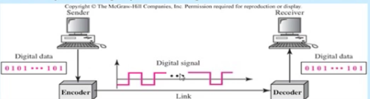
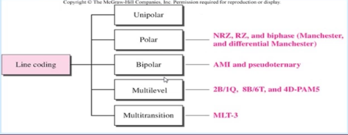
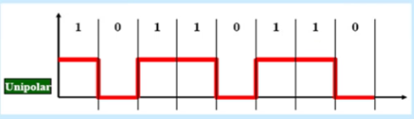
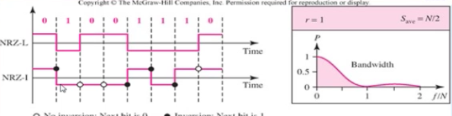
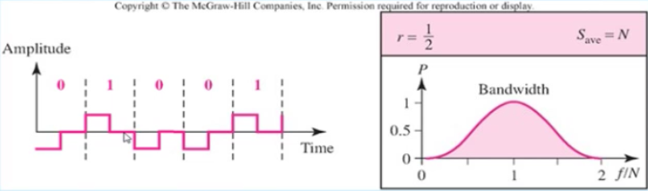
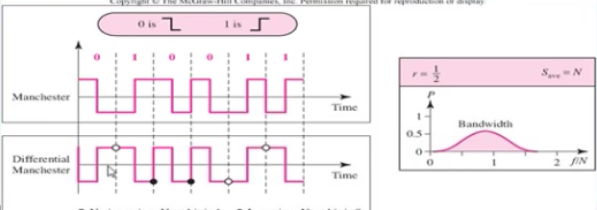
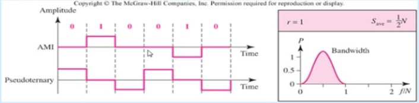

Sayısal Veri - Sayısal Sinyal
--------

#### Sayısal iletim
Sayısal iletimde iki alternatif vardır.
* Sayısal Veri -> Sayısal Sinyal
* Analog Veri -> Sayısal Sinyal

Veri kaynağı analog veya sayısal olabilir fakat sinyal sayısal olmalıdır.


#### Sayısal Veri -> Sayısal Sinyal
Sayısal veriyi sayısal sinyale dönüştürme işletime Hat Kodlama (Line encoding) denir. Ayrıca Sayısal Baseband Modülasyonuda denir. Bu dönüşümde bir taşıyıcı sinyali kullanılmaz.

İkili veri (sayısal) hat kodlama dönüşümleri vasıtasıyla sayısal bir sinyal haline dönüştürülür. Bilgisayar verisinin gönderilmesi örnek olarak verilebilir.



#### Bit hızı ve Baud (Sinyal) Hızı
Veri iletişiminde en küçük parça bit olarak isimlendirilebilir. Veri hızı bir saniyede iletilen bit hızını tanımlar, veri hızı bit hızı olarakta tanımlanabilir. Sinyal hızı (baud hızı = darbe hızı = modülasyon hızı = sembol hızı) bir saniyede iletilen sinyal sayısını gösterir (baud/s)

Modülasyon tekniklerinde amaç düşük baud hızı üzerinden yüksek bit hızı değeri elde etmektir. Bandgenişliği sinyali taşımak için gereken frekans spektrumunu gösterir. Sinyaldeki değişim sayısı artarsa daha geniş frekans spektrumu kullanılır.

```
r bir sinyal ile taşınan bit sayısını gösteriyorsa.
Nyquist bit hızı = 2Br
Baud hızı = N / 2r (N bit hızı)
```

#### Hat Kodlama Teknikleri


#### Unipolar ( Tek kutuplu ) Kodlama
Tek seviyeli bir değere sahiptir, bit 1 pozitif gerili ve bit 0, 0 V ile tanımlanır.



#### NRZ Kodlama Teknikleri (Polar-Seviye Tabanlı)
**NRZ-L (level) kodlama tekniği:** 1 değerinde düşük voltaj, 0 değerinde yüksek voltaj kullanılır. Bir bit bilginin gönderiliğinde voltaj belirli seviyede tutulacaktır. Kısa bağlantılar için kullanılır _örneğin RS-232_

**NRZ-I (invert) kodlama tekniği:** 1 değerinde voltaj seviyesi değişir, 0 değerinde voltaj seviyesini değiştirme. Bir bit bilginin gönderiliğinde voltaj belirli bir seviyede tutulur. Bazı ISDN kanallarında kullanılır.



#### RZ (Return to Zero) 
Üç seviye kullanılır (+v, -v, 0). Sinyal bitinin orta seviyesinde 0'a döner. Bir bit için daha sinyal değişimi gerekir. DC bileşen problemi yoktur.



#### Manchester ve Farksal Manchester Kodlama
**Manchester Kodlama Tekniği** 0 değerinde düşen kenar, 1 değerinde yükselen kenar.

**Farksal Manchester Kodlama Tekniği**: 0 değeri bit süresinin başında düzey değişimi gösterirken, 1 değeri için bit süresinin başında düzey aynı kalır. Bit süresinin ortasında her iki bit değeri içinde düzey değişimi olur.




#### AMI ve Pseudotenary (Bipolar)
**AMI (Alternate Mark Invision) kodlama:** 0 için 0 Volt seviyesi kullanılırken, 1 çin ise sırayla pozitif ve negatif gerilim kullanılır. 

**Pseudotenary kodlama** 1 için 0 volt seviyesi kullanılırken, 0 için ise sırayla pozitif ve negatif gerilim kullanılır. AMI'nin tersidir.



#### Multilevel Kodlama yöntemleri
2B1Q, 8B6T, 4D-PAM5 yöntemleri multilevel kodlama yöntemleri içerisinde yer alır. Bu şekildeki kodlama **mBnL** olarak isimlendirilir. ilk ikisi (**mB**) veriyi, son ikisi (**nL**) sinyali gösterir. **m** veri biti sayısını (ikili verinin uzunluğunu) **n** de sinyal sayısını (sinyal uzunluğunu) gösterir. İkili veri sadece 0 ve 1 değerine sahip olacağından m adet veriyi 2^m farklı sinyalle gösterebiliriz. İsimlendirmedeki B'de ikili veriyi tanımlar. L ise seviyeyi tanımlar. L=2 ise **B**, L=3 ise **T** L=4 ise **Q** kullanılır
