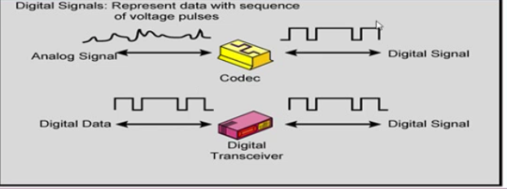

Sayısal Veri - Sayısal Sinyal
--------

#### Sayısal iletim
Sayısal iletimde iki alternatif vardır.
* Sayısal Veri -> Sayısal Sinyal
* Analog Veri -> Sayısal Sinyal

Veri kaynağı analog veya sayısal olabilir fakat sinyal sayısal olmalıdır.



#### Sayısal Veri -> Sayısal Sinyal
Sayısal veriyi sayısal sinyale dönüştürme işletime Hat Kodlama (Line encoding) denir. Ayrıca Sayısal Baseband Modülasyonuda denir. Bu dönüşümde bir taşıyıcı sinyali kullanılmaz.

İkili veri (sayısal) hat kodlama dönüşümleri vasıtasıyla sayısal bir sinyal haline dönüştürülür. Bilgisayar verisinin gönderilmesi örnek olarak verilebilir.


#### Bit hızı ve Baud (Sinyal) Hızı
Veri iletişiminde en küçük parça bit olarak isimlendirilebilir. Veri hızı bir saniyede iletilen bit hızını tanımlar, veri hızı bit hızı olarakta tanımlanabilir. Sinyal hızı (baud hızı = darbe hızı = modülasyon hızı = sembol hızı) bir saniyede iletilen sinyal sayısını gösterir (baud/s)

Modülasyon tekniklerinde amaç düşük baud hızı üzerinden yüksek bit hızı değeri elde etmektir. Bandgenişliği sinyali taşımak için gereken frekans spektrumunu gösterir. Sinyaldeki değişim sayısı artarsa daha geniş frekans spektrumu kullanılır.

```
r bir sinyal ile taşınan bit sayısını gösteriyorsa.
Nyquist bit hızı = 2Br
Baud hızı = N / 2r
```