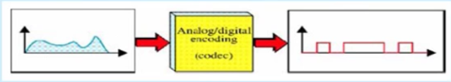
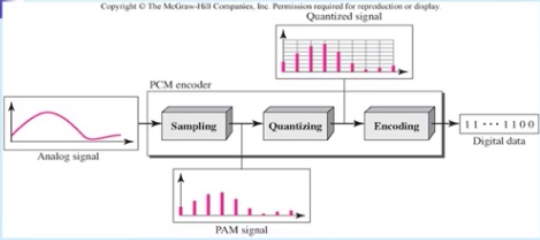
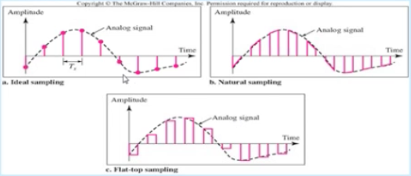
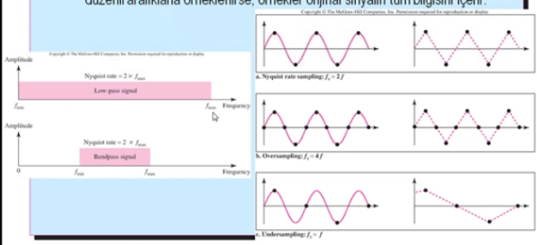
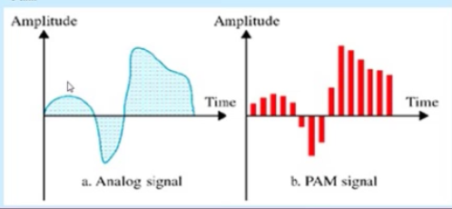
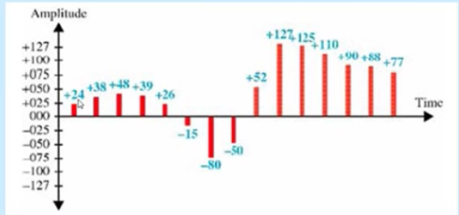
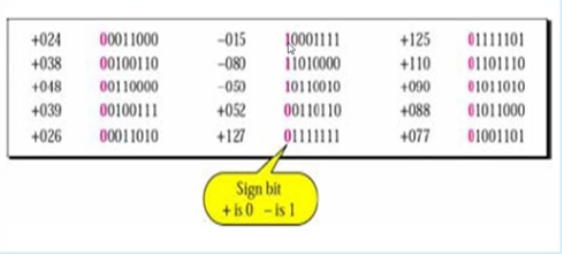

Analog Sinyal - Sayısal Sinyal
-----

Analog sinyal sayısallaştırılır. Analog sinyalden sayısal bir sinyal haline dünüşüm codec ile yapılır. Kullanılan modülasyon teknikleri **darbe kod modülasyonu (Pulse Code Modulation)**, ** delta modülasyon **

#### Darbe Kod modülasyonu (Pulse Code Modulation)

En yaygın kullanılan analog sinyal - sayısal veri dönüşüm yöntemidir. Aynı zamanda kaynak kodlama olarakta tanımlanır. Mikrofon veya kamera tarafından üretilen analog sinyallerin iletim ortamına verilmesi için gerekli kodlama işlemerini yapar.

* Örnekleme
* Kuantalama
* Kodlama

#### Örnekleme (Sampling)
Darbe kod modülasyonun ilk aşamasıdır. Her T aralığında bir örnek alınır ve alınan bu örneğin sayısal bir değeri bulunur. 

##### Nyquist Teoremi
Eğer bir sinyal, en yüksek sinyal frekansının iki katından daha yüksek bir hızda düzenli aralıklarla örneklenirse, örnekler orjinal sinyalin tüm bilgisini içerir.

##### Örnekleme Hızı
**Örnek** _İnsan sesini sayısallaştırmak isteyelim, her örneğin 8 bitle örneklendiğini varsayarsak bit hızı nedir?_

**Çözüm** _İnsan sesi normal olarak 0'dan 4000Hz'e kadar frekansları içerir. (telefon hatları için) Örnekleme hızı 4000 * 2 = 8000 örnek/sn, bit hızı = örnekleme hızı * her örnek başına düşen bit sayısı = 8000 * 8 = 64000 bps = 64kpbs_

#### Kuantalama (Quantizing)
Darbe kod modülasyonunun ikinci aşaması Sayısallaştırma (Kuantalama)'dır, her bir analog örneğe ikili bir oda tahsis edilir. Analog örneker darbe genlik modülasyonu (PAM) örnekleri olarak elde edilir.

#### Kodlama (Encoding)
Sayısal sinyal, bir PCM darbesinin genliğini tanımlayan n bit uzunluğunda sayısal veri bloğuna kodlanır.

