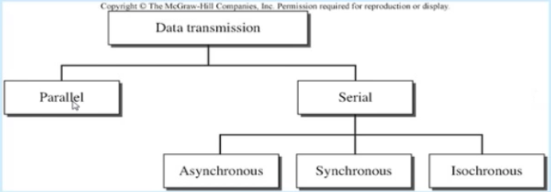
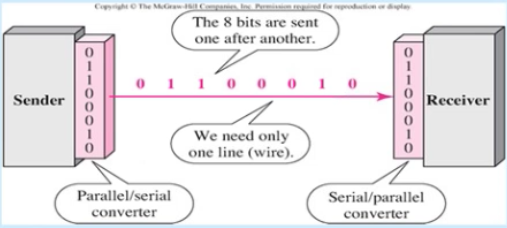
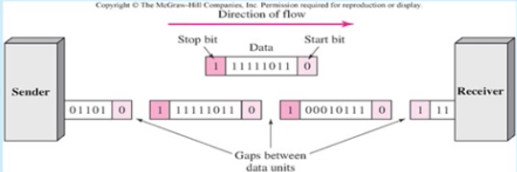
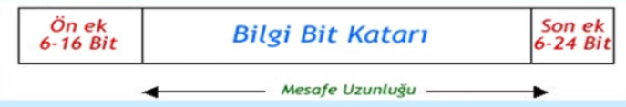

Analog Sinyal - Sayısal Sinyal
-----

Analog sinyal sayısallaştırılır. Analog sinyalden sayısal bir sinyal haline dünüşüm codec ile yapılır. Kullanılan modülasyon teknikleri **darbe kod modülasyonu (Pulse Code Modulation)**, ** delta modülasyon **

#### Darbe Kod modülasyonu (Pulse Code Modulation)

En yaygın kullanılan analog sinyal - sayısal veri dönüşüm yöntemidir. Aynı zamanda kaynak kodlama olarakta tanımlanır. Mikrofon veya kamera tarafından üretilen analog sinyallerin iletim ortamına verilmesi için gerekli kodlama işlemerini yapar.

* Örnekleme
* Kuantalama
* Kodlama

#### Örnekleme (Sampling)
Darbe kod modülasyonun ilk aşamasıdır. Her T aralığında bir örnek alınır ve alınan bu örneğin sayısal bir değeri bulunur. 

##### Nyquist Teoremi
Eğer bir sinyal, en yüksek sinyal frekansının iki katından daha yüksek bir hızda düzenli aralıklarla örneklenirse, örnekler orjinal sinyalin tüm bilgisini içerir.

##### Örnekleme Hızı
**Örnek** _İnsan sesini sayısallaştırmak isteyelim, her örneğin 8 bitle örneklendiğini varsayarsak bit hızı nedir?_

**Çözüm** _İnsan sesi normal olarak 0'dan 4000Hz'e kadar frekansları içerir. (telefon hatları için) Örnekleme hızı 4000 * 2 = 8000 örnek/sn, bit hızı = örnekleme hızı * her örnek başına düşen bit sayısı = 8000 * 8 = 64000 bps = 64kpbs_

#### Kuantalama (Quantizing)
Darbe kod modülasyonunun ikinci aşaması Sayısallaştırma (Kuantalama)'dır, her bir analog örneğe ikili bir oda tahsis edilir. Analog örneker darbe genlik modülasyonu (PAM) örnekleri olarak elde edilir.

#### Kodlama (Encoding)
Sayısal sinyal, bir PCM darbesinin genliğini tanımlayan n bit uzunluğunda sayısal veri bloğuna kodlanır.

#### İletişim Teknikleri
Sayısal veri bir iletim ortamı üzerinden ya seri yada paralel modda aktarılabilir.

#### Seri İletişim Tekniği
Gönderilecek bilginin tek bir iletim yolu üzerinden sıra ile aktarıldığı iletim şeklidir. Sayısal formattaki bilginin aktarım hızı "baud" birimiyle ölçülür. PC'lerdeki seri portlar, seri iletişim tekniği kullanırlar(COM portlar RS232). Seri iletişim kendi arasında Asenkron, Senkron, Isenkron olmak üzere 3'e ayrılır.

##### Asenkron Seri İletişim Tekniği
Gönderici ve alıcının birbirinden bağımsız hareket ettikleri bir iletişim şeklidir. Gönderilecek bilgi, "karakter" adı verilen bloklara ayrılır. Sonra iletim ortamına seri olarak verilir. Bir blokta genellikle 7 veya 8 bit bulunur. Her veri bloğu başla bitiyle başlar, ve dur bitiyle sonlanır. Alıcı bu bitler vasıtasıyla gelen veriyi anlar/yakalar.

##### Senkron Seri İletişim Tekniği
Gönderici, saat işaretini bilgi ile modüle ederek alıcıya gönderir. Alıcı, vericinin gönderdiği işaret dizisini kullanarak (uygun devreler yardımı ile) vericinin frekansı ile eşit frekanslı bir senkronizasyon işareti elde eder.

Senkronizasyon işlemi için modülasyon gerektirmeyen ikinci bir yol, verici ve alıcı arasında bulunan bir hat üzerinden saat işaretinin gönderilmesidir.

Uzunluğu kullanılan protokole göre değişen bilgi bit katarına ön ve son ekler konularak alıcının bilginin başlangıç ve sonunu belirlemesi sağlanır. Eklenen ön ve son eklerin uzunlukları, kullanılan protokole bağlı olarak belirlenir. 

##### Isenkron Seri İletişim Tekniği
Senkron iletişimin bir çeşidi denebilir. Isenkron bilgi iletiminde uç sistemlerin birbirleri ile olan haberleşme gereksinimi periyodik olarak karşılanır. Sabit hızda verinin iletimi sağlanır.

**Örneğin** _her 125 mikro saniyede 193 bit aktarılacak bir gereksinim belirtilir ve bu garanti olarak sağlanır_

Bu tür iletişim özellikle gerçek zamanlı ses video aktarım uygulamalarında yada kritik veri transferi gerektiren endüstiriyel otomasyon/kontrol sistemlerinde kullanılır.

