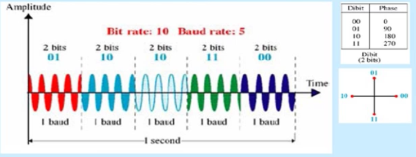

Analog İletim
------
* Sayısal Veri, Analog Sinyal
* Analog Veri, Analog sinyal
* Analog ve Sayısal veriyi taşıyan analog sinyaller


**Analog iletimde Baud hızı**

```
(Sayısal iletimde Baud hızı N / 2r idi)
Baud hızı = N / r
r = 1 sinyaldeki bit sayısı
N = saniyede atılan bit sayısı
```

#### Sayısal Veri, Analog Sinyal
Sayısal bir veri modülasyona tabi tutularak analog bir sinyal haline dönüştürülür. Genel telefon sistemi bu dönüşüme en temel örnektir. Bilgisayar verisi modem vasıtasıyla analog sinyal haline dönüştürülüp telefon hattı üzerinden gönderilir.


#### Sayısal Veriden Analog Sinyale Kodlama Yöntemleri
Sinyaller bölümünde ifade edildiği gibi, bir sinüs dalgası genlik frekans ve faz parametreleri ile tanımlanmaktadır. Bu parametreler 4 farklı temel modülasyon tekniğini ortaya çıkartmıştır. Bu kodlamalar literatürde sayısal modülasyon teknikleri olarakta tanımlanmaktadırlar.


#### ASK (Amplitude Shift Keying)
Genlik değiştirilerek anahtarlama yapılır. Taşıyıcı sinyalin genliği değiştirilir. Genellikle taşıyıcının varlığı ve yokluğu ile ifade edilir. Birçok genlik seviyeside oluşturulabilir.


#### FSK (Frekans Shift Keying)
Taşıyıcı sinyalin frekansı değiştirilir. Değerler iki farklı frekans değeri ile temsil edilir. Binary FSK olarakta isimlendirilir.


#### PSK (Phase Shift Keying)
Taşıyıcı sinyalin fazı değiştirilir. Aşağıdaki şekilde 0* ve 180* faz farklı iki sinyal kullanılır. Bundan dolayı Binary PSK'da  denir. PSK sadece bir tane taşıyıcı frekans gerektirir. FSK seviye sayısı kadar gerektirir.


#### 4-PSK
2 bitle 4 değer temsil edilir. Bundan dolayı 4-PSK olarak adlandırılır.



#### 8-PSK
3 bitle 8 değer temsil edilir bundan dolayı 8-PSK olarak adlandırılır.


#### Quadrature Amplitude Modulation (QAM)

QAM, ADSL ve bazı kablosuz sistemler üzerinde kullanılır. ASK ve PSK'nın bir kombinasyonudur. Aynı taşıyıcı frekansı üzerinde eş zamanlı olarka iki farklı sinyal gönderir.


#### Takımyıldızı (Consellation) Diyagramı

Sinyalin genlik ve fazlık değerini göstermek için kullanılır, ASK PSK ve QAM için kullanılır. Her nokta faz ve genlik değerini gösterir.


