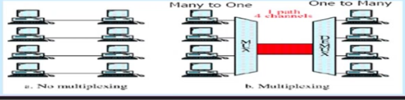
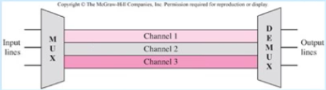
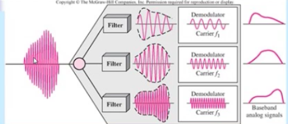
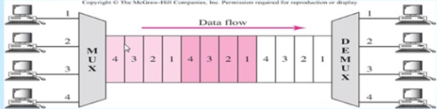
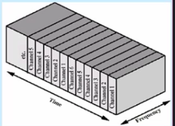
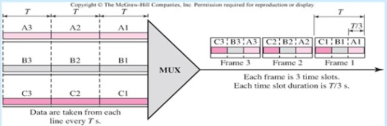
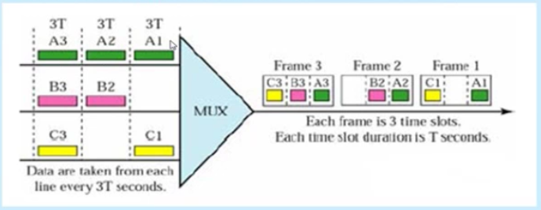

Çoğullama
------

İletim ortamının kapasitesi tek bir sinyalin iletimi için gerekli olan kapasiteden büyüktür. Çoğullama birden fazla sinyalin tek bir iletim ortamı üzerinden tek bir sinyal halinde birleştirerek taşınmasını tanımlar. Yüksek hızlı telekomünikasyon hatlarının (koaksiyel, fiber optik) etkili kullanımı için bazı çoğullama teknikleri kullanılır. Kablosuz sistemlerde paylaşılacak ortam havadır.

#### Çoğullama Teknikleri
Çoğullama teknikleri birden fazla kullanıcının aynı ortamı birbirlerini etkilemeden nasıl paylaşacaklarını belirler. Çoğullama iletim ortamının kapasitesini farklı iletim kaynaklarına paylaştırmaya izin verne bir kavramdır ve üç çeşit kullanımı vardır.

* FDM frekans bölmeli çoğullama
* TDM zaman bölmeli çoğullama
* CDM kod bölmeli çoğullama

#### Frekans Bölmeli Çoğullama
İletişim kanallarında frekans paylaşımını öngörmektedir. Her  bir sinyal farklı bir taşıyıcı frekansı ile modüle edilir. 

Her sinyalin iletimi için farklı bir frekans bandı kullanılarak sinyallerin birbirine karışması önlenirken (koruma bandları ile birlikte) aynı zamanda birden fazla analog sinyalin birleştirilerek aynı kanaldan iletilmeside mümkün kılınmaktadır.

Veri olasa bile kanal tahsis edilir. FDM analog işaretlerinin çoğullamasında kulllanılır. Örneğin Radyo ve TV yayınları 

##### Verici taraf

##### Alıcı taraf

#### Dalga Uzunluğu Bölmeli Çoğullama
WDM ile kısaltılır. fiber optik kablonun yüksek bantgenişliğini kullanmak için tasarlanmıştır. FDM'e benzer fakat daha yüksek frekanslara sahiptir. Çoğu 1550 nm dalga uzunluğu aralığında (yaklaşık 194tHz)

WDM optik sinyalleri birleştiren bir multiplexing tekniğidir. Çoğullayıcı kaynakları tek bir fiber üzerinden iletim için birleştirir. Birden fazla ışık hüzmesinin farklı frekanslarda aynı fiber üzerinden iletilmesi tekniğidir. 

Işığın her bir rengi ayrı veri kanalı üzerinden taşınır. Bir çok kaynaktan farklı frekanslarda lazer ışını üretilir. Şu anda 10 gbps band genişliğine sahip 160 kanallık ticari ürünler bulunmaktadır.

Alcatel Lab ortamında her biri 39.8 gbps bandgenişliğine sahip 256 kanalla 10.1 tbpslik iletimi 100kmlik bir mesafede gerçekleştirmiştir.

Dense WDM (DWDM) kanalları birbirlerine çok yakın çoğullayarak daha çok kanalı birleştirir.

#### Zaman Bölmeli Çoğullama

TDM yüksek bant genişliğine sahip bir linki birden çok bağlantıya paylaştırır. Bir çok sayısal sinyal zaman boyutunda birbirinden ayırt edilir.

##### Senkron TDM

Zaman aralıkları kaynaklara önceden tahsis edilir ve sabittir. Veri olmasa bile zaman aralıkları tahsis edilir. Zaman aralıkları kaynaklar arasında bir girişim oluşturmayacaktır.

Senkron TDM'de her bir kaynağın verisi birimlere ayrılır. Kaynak verilerinin iletim ortamında kullandıkları zaman aralıklarının toplamı TDM çerçevesini oluşturur. Yani bir TDM çerçevesi tüm kaynakların 1 birim verisinin birleştirilmesinden oluşur.

Kaynakların gönderecek verisi olmayabilir. Bu durumda kaynak için atanan zaman aralığı boş kalır diğer kaynaklar kullanamaz.

##### Asenkron TDM

