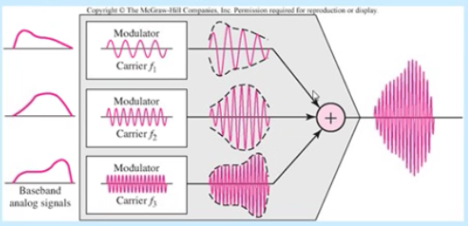

Çoğullama
------

İletim ortamının kapasitesi tek bir sinyalin iletimi için gerekli olan kapasiteden büyüktür. Çoğullama birden fazla sinyalin tek bir iletim ortamı üzerinden tek bir sinyal halinde birleştirerek taşınmasını tanımlar. Yüksek hızlı telekomünikasyon hatlarının (koaksiyel, fiber optik) etkili kullanımı için bazı çoğullama teknikleri kullanılır. Kablosuz sistemlerde paylaşılacak ortam havadır.

#### Çoğullama Teknikleri
Çoğullama teknikleri birden fazla kullanıcının aynı ortamı birbirlerini etkilemeden nasıl paylaşacaklarını belirler. Çoğullama iletim ortamının kapasitesini farklı iletim kaynaklarına paylaştırmaya izin verne bir kavramdır ve üç çeşit kullanımı vardır.

* FDM frekans bölmeli çoğullama
* TDM zaman bölmeli çoğullama
* CDM kod bölmeli çoğullama

#### Frekans Bölmeli Çoğullama
İletişim kanallarında frekans paylaşımını öngörmektedir. Her  bir sinyal farklı bir taşıyıcı frekansı ile modüle edilir. 

Her sinyalin iletimi için farklı bir frekans bandı kullanılarak sinyallerin birbirine karışması önlenirken (koruma bandları ile birlikte) aynı zamanda birden fazla analog sinyalin birleştirilerek aynı kanaldan iletilmeside mümkün kılınmaktadır.

Veri olasa bile kanal tahsis edilir. FDM analog işaretlerinin çoğullamasında kulllanılır. Örneğin Radyo ve TV yayınları 

##### Verici taraf

##### Alıcı taraf

#### Dalga Uzunluğu Bölmeli Çoğullama
WDM ile kısaltılır. fiber optik kablonun yüksek bantgenişliğini kullanmak için tasarlanmıştır. FDM'e benzer fakat daha yüksek frekanslara sahiptir. Çoğu 1550 nm dalga uzunluğu aralığında (~ 194tHz)