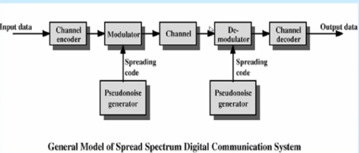
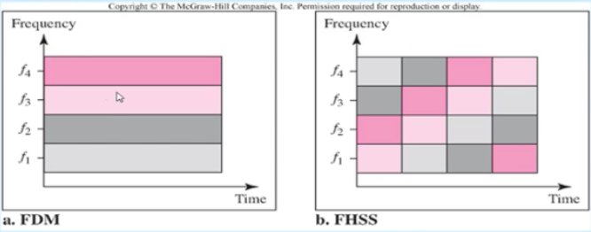

Yayılı Spektrum
------

#### Dar Band Tekniği
RF sinyallerinin mümkün olan en dar frekans arlaığında gönderimesi ve alınması esasına dayanır. Veri hızı düşük fakat iletişim mesafesi uzundur. Sistem enterferansa duyarlıdır. Her kullanıcının farklı frekans kanalı kullanması gerekir. Aksi durumda enterferans oluşur ve iletişimde bozulma veya kesilme meydana gelir. 

Dar bant tekniği ile kıt kaynak olan frekans spektrumu verimli kullanılamaz. WLAN sistemlerinde kullanılmamaktadır. TV, AM/FM Radyo

#### Yayılı Spektrum
Yayılı Spektrum (Spread Spectrum) ilk olarak kritik güvenli ve gizli askeri haberleşme sistemleri için yaklaşım 50 yıl önce geliştirilmiş bir geniş bant kablosuz RF iletişim tekniğidir.

Yayılı spektrum tekniğinde gönderilecek sinyal bir kod ile birlikte belirli bir bandın tümüne yayılarak yada önceden elirlenmiş bir üzene deavamlı frekans atılarak gönderilir.

Şu anda WLAN sistemlerinde yaygın olarak FHSS ve DSSS olmak üzere 2 teknik kullanılmaktadır. Her iki teknik için 2.4 gHz frekans bandında 2400mHz - 2483.5 mHz frekans aralığı ve 83.5 mHz bant genişliği kullanılmaktadır. 

Güvenlik dikkate alınarak hem izinsiz erişimi hemde veri çalınmasını önlemek için veri kodlama metodu kullanılmaktadır.

Yayılı spektrum teknolojisi dar bant teknolojisine göre çok daha fazla bant genişliği kullanılmasına rağmen yakın frekanslarda çalışan diğer telsiz sistemlerini bozmadan birlikte çalışmasına imkan vermektedir.

Giriş verisi bir kanal kodlayıcı içerisine beslenir. Dar band genişlikli analog sinyal üretilir. Bu sinyal sayı dizisi kullanılarak tekrar modüle edilir. Pseudonoise veya pseudo-rastgele sayı üreteci tarafından üretilir. Modülasyonun etkisi iletilecek sinyalin bandgenişliğini arttıracaktır. Alıcı tarafında yayılı spektrum sinyalini demodüle etmek için bu sayı dizisi kullanılır. Sinyal veriyi elde etmek için bir kanal kod çözücü içerisine beslenir.

#### FHSS (Frequency Hopping Spread Spectrum)
Sinyal sabit aralıklara sahip frekanstan frekansa atlar. Pseudorandom code generator k-bit örüntü oluşturur, her örüntü atlama peryodu süresince bir hop için kullanılır. yani verici bir anda sadece bir kanal içerisinde çalışır ve her bir kanal için yeni bir taşıyıcı frekansı seçilir. Verici ve alıcı bu örüntü için senkronize olurlar. Doğru senkronizasyon sağlandığında sürekli bir kanal elde edilmektedir.

FHSS tekniği için 2402-2480 mHz frekans aralığında 1 mHz band genişliğine sahip 79 kanal bulunmaktadır.

Veri çok küçük paketlere bölünerek rastgele değişen 79 mHz genişliğindeki kanallardan seçilir. Sadece önceden anlaşma sağlanan şablon frekansında senkronize olmuş alıcı verici cihazlar bu veriyi alıp gönderebilirler. Bir atlama frekansındaki azami bekleme süresi 400ms'dir.

##### FDM ve FHSS

